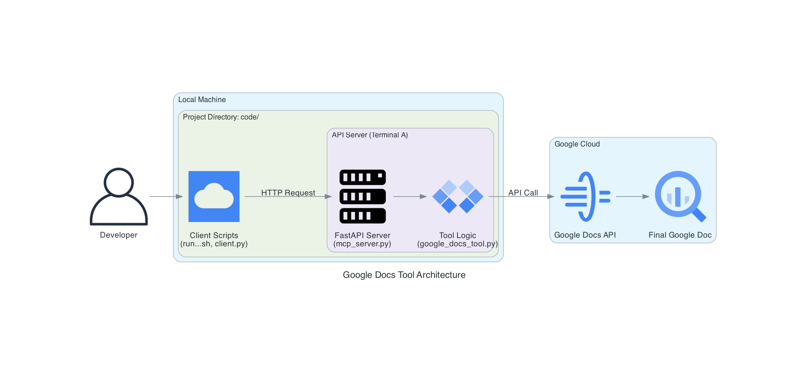

# Google Docs Markdown Uploader

这是一个独立的命令行工具集，允许用户将本地的 Markdown 文件（支持H1/H2/H3标题和粗体）写入指定的 Google 文档中。本项目采用客户端/服务器架构，并包含一套完整的本地及集成测试流程。

## 架构图



---

## 1. 环境准备 (Prerequisites)

在开始之前，请确保您的系统中已经安装了以下软件：

- **Python 3.10+**
- **uv**: 一个现代的 Python 包管理器。如果尚未安装，请运行 `pip3 install uv`。

## 2. 配置步骤 (Setup)

要使用此工具，您需要先完成 Google Cloud 服务账号的配置和授权。

### 步骤 2.1: 创建 Google Cloud 服务账号并下载凭证

1.  访问 [Google Cloud Console](https://console.cloud.google.com/)。
2.  导航到 **IAM 与管理** > **服务账号**。
3.  点击 **创建服务账号**，为其命名（例如 `google-docs-writer`），并授予它**编辑者 (Editor)** 角色。
4.  创建并下载 **JSON 格式** 的服务账号密钥。

### 步骤 2.2: 放置凭证文件

- 将您上一步下载的 JSON 凭证文件，重命名为 `docs-writer-credentials.json`。
- 然后，将它移动到本项目的 `credentials/` 目录下。

### 步骤 2.3: 为 Google 文档授权

1.  打开您希望本工具写入的目标 Google 文档。
2.  点击右上角的 **共享 (Share)** 按钮。
3.  将您服务账号的**电子邮件地址**（可以在 JSON 凭证文件的 `client_email` 字段中找到）添加为**编辑者 (Editor)**。

### 步骤 2.4: 安装项目依赖

1.  在终端中，进入本项目根目录 (即 `google-docs-tool` 目录)。
2.  使用 `uv` 创建并激活虚拟环境：
    ```bash
    uv venv
    source .venv/bin/activate
    ```
3.  安装所有依赖：
    ```bash
    uv pip install -r requirements.txt
    ```

## 3. 使用指南 (Usage)

本工具采用客户端/服务器模式，您需要分别启动服务和客户端。

### 步骤 3.1: 启动服务

- 在一个终端窗口中，确保您位于项目根目录 (`google-docs-tool`) 下，并已激活虚拟环境。
- 使用 `-m` 方式启动服务，并使其保持运行：
  ```bash
  python3 -m src.server.mcp_server
  ```

### 步骤 3.2: 运行客户端

- 打开**另一个**终端窗口，同样进入项目根目录 (`google-docs-tool`)。
- **命令格式**: `python3 client.py <你的文档ID> <你的Markdown文件路径>`

- **示例**:
  ```bash
  # 假设你的报告在与 google-docs-tool 文件夹同级的目录
  python3 client.py "1a2b3c4d5e6f7g8h9i0j" ../MyReport.md
  ```

## 4. 测试指南 (Testing)

所有测试命令都应在项目根目录 (`google-docs-tool`) 下运行。

### 4.1 运行本地测试

此测试会模拟 Google API，可以快速、安全地验证代码逻辑。

```bash
./run_tests.sh
```

### 4.2 运行在线集成测试

此测试会真实地向您的 Google 文档写入内容。运行前，请先通过参数提供所需信息。

```bash
./run_tests.sh --online --doc-id "你的文档ID" --creds-path "./credentials/docs-writer-credentials.json"
```
